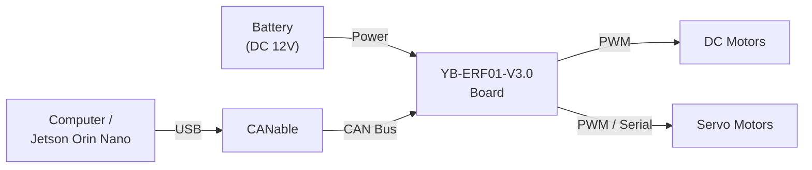
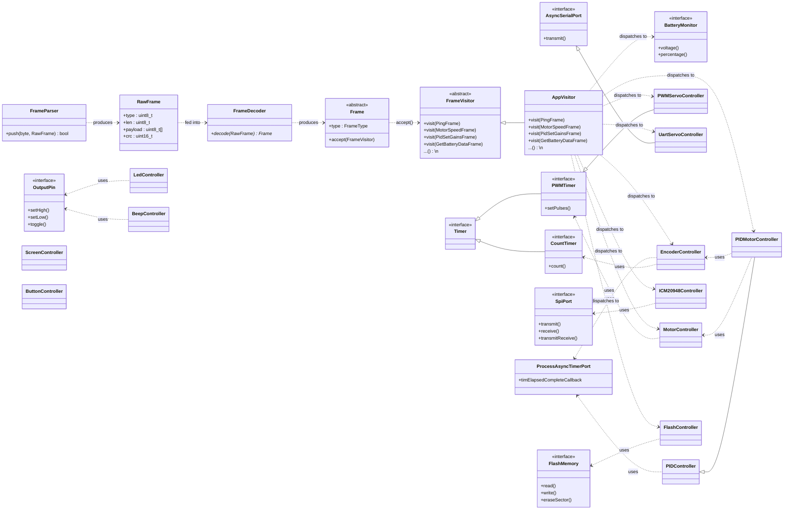
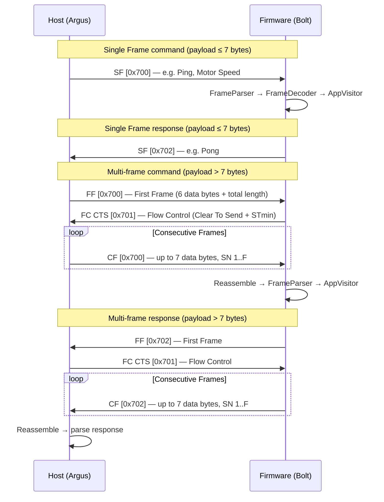

# Bolt

Embedded firmware for an STM32F103RCTx (ARM Cortex-M3, 256K Flash / 48K RAM) robotics platform. Bolt controls motors, servos, and encoders through a binary frame protocol over UART or CAN bus, using FreeRTOS for real-time task management. Written in C++17 with a C11 HAL layer.


## Physical Architecture

A host computer (Jetson Orin Nano or PC) sends commands to the YB-ERF01-V3.0 board through a CANable USB-to-CAN adapter. The board drives up to 4 DC motors via PWM and up to 10 servos (4 PWM, 6 serial). Encoder feedback from each motor is read by the board and reported back to the host over the same CAN bus link. The entire system is powered by a 12V battery connected to the board's DC input.



## Build

### Firmware

Requires `arm-none-eabi-gcc` toolchain. Available presets: `Debug`, `RelWithDebInfo`, `Release`, `MinSizeRel`.

```bash
# Configure
cmake --preset Debug

# Build
cmake --build --preset Debug

# Flash via SWD
STM32_Programmer_CLI -c port=SWD -w build/Debug/bolt.elf -hardRst
```

### Tests (Host-based, GoogleTest)

```bash
# Configure
cmake --preset default -S tests

# Build
cmake --build ./build/tests --preset default

# Run all tests
cd ./tests && ctest --preset default && cd ..

# Run a single test by name
./build/tests/bolt_tests --gtest_filter="TestSuiteName.TestName"
```

## Software Architecture

The firmware follows a layered design that separates hardware access from application logic.

**Interfaces** define abstract contracts for each peripheral type (`OutputPin`, `PWMTimer`, `SpiPort`, `FlashMemory`, etc.). Each interface is a pure virtual C++ class with no HAL dependencies, declared in `Bolt/Inc/bolt/interface.hpp`. Concrete implementations in `Bolt/Inc/bolt/interface/` wrap STM32 HAL calls behind these contracts, so the rest of the codebase never touches registers directly.

**Controllers** implement domain logic on top of one or more interfaces. For example, `MotorController` receives a `PWMTimer` to drive DC motors, `EncoderController` uses `CountTimer` to track wheel rotations, and `ICM20948Controller` reads IMU data through a `SpiPort`. Controllers are stateful objects that own calibration, filtering, and protocol details. `PIDMotorController` extends `PIDController` by wiring an encoder as its feedback source and a motor as its output actuator.

**Visitor** ties the protocol layer to the controllers. Incoming bytes flow through `FrameParser` (state machine) and `FrameDecoder` (type validation) to produce typed frame objects. Each frame calls `accept()` on the `AppVisitor`, which dispatches the command to the appropriate controller. This visitor pattern decouples frame definitions from processing logic, making it straightforward to add new commands without modifying the parser.



## FreeRTOS Task Pipeline

Five tasks form the command processing pipeline, communicating via FreeRTOS queues (`configTOTAL_HEAP_SIZE` = 9000 bytes):

| Task | Stack | Role |
|------|------:|------|
| `vCommand_Task` | 192 words | Receives raw bytes from UART (`USART1`) or CAN bus |
| `vProcess_Task` | 384 words | Feeds bytes through `FrameParser` → `FrameDecoder` → `AppVisitor` |
| `vQuery_Task` | 192 words | Sends response frames back over UART or CAN |
| `v2Process_Task` | 256 words | Polls `ProcessAsyncTimerPort` registry every 5 ms; fires callbacks when counters expire — drives `EncoderController` and `PIDController` sampling |
| `vLed_Task` | 128 words | LED heartbeat indicator |

## Peripheral Mapping

| Peripheral | Function |
|------------|----------|
| TIM1 | Motors 3–4 (PWM + complementary PWM_N) |
| TIM8 | Motors 1–2 (PWM channels) |
| TIM7 | PWM servo software timer (GPIO bit-bang, PC0–PC3) |
| TIM2/3/4/5 | Encoder counters (one per motor) |
| USART1 | Host communication (non-CAN mode) / debug `printf` |
| USART3 | Serial servo bus |
| SPI2 | ICM20948 IMU (software NSS via PB12) |
| CAN bus | ISO-TP transport — RX: 0x700, FC: 0x701, TX: 0x702 |

## Controller Details

| Controller | Details |
|------------|---------|
| **MotorController** | 4 motors via TIM1/TIM8. Signed pulse input; dead-zone offset of 1600 added internally (PWM range 1600–3600). Frame protocol uses 1-based IDs; code converts to 0-based. |
| **PWMServoController** | 4 servos via TIM7 software PWM on GPIO pins PC0–PC3. |
| **UartServoController** | 6 servos over USART3 serial protocol, pulse range 96–4000. Get-angle command retries up to 10× with 2 ms delays. |
| **EncoderController** | 4 encoders on TIM2/3/4/5, 2464 CPR, 100 ms sampling period (20 × 5 ms tick), low-pass filtered (α = 0.2). |
| **ICM20948Controller** | 9-axis IMU (accel/gyro/mag + temperature) over SPI2. Uses internal I2C master for AK09916 magnetometer at 100 Hz. Bank-switched register access. Defaults: gyro ±2000 DPS, accel ±16 g. |
| **PIDMotorController** | Closed-loop PID control wiring `EncoderController` as feedback and `MotorController` as actuator. Gains persist to flash via `FlashController`. |
| **BatteryMonitor** | Reports voltage (V) and charge level (%). |

## CAN Bus ISO-TP Communication

The host (Argus driver) and firmware (Bolt) exchange framed commands over CAN bus using ISO-TP segmentation. Single frames carry messages up to 7 bytes; larger messages use a First Frame / Flow Control / Consecutive Frame handshake. Three standard CAN IDs are used: `0x700` (host → firmware data), `0x701` (flow control, bidirectional), and `0x702` (firmware → host data).



## Protocol

Find details in the following file [protocol](docs/PROTOCOL.md)
