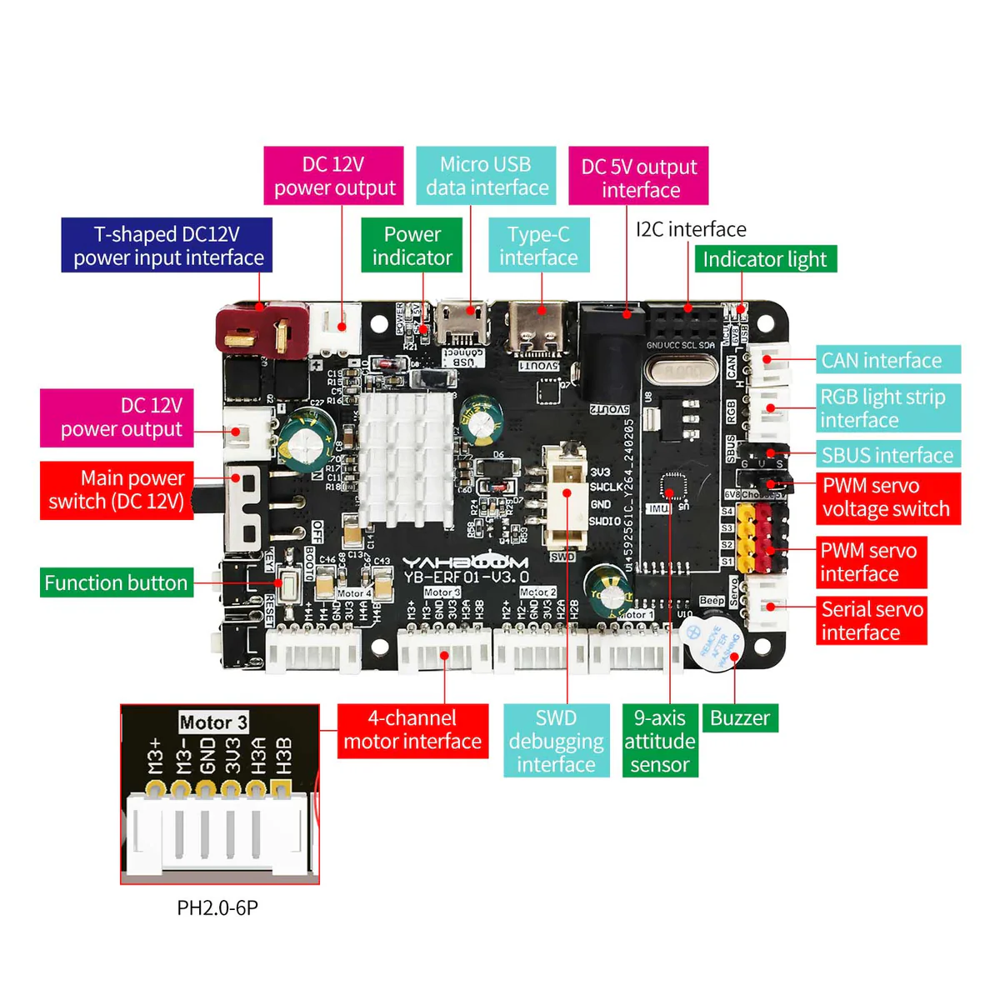
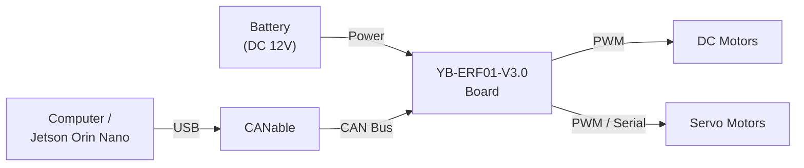

# Bolt

Embedded firmware for an STM32F103XE (ARM Cortex-M3) robotics platform. Bolt controls motors, servos, and encoders through a binary frame protocol over UART or CAN bus, using FreeRTOS for real-time task management. Written in C++17 with a C11 HAL layer.

## Physical Architecture

A host computer (Jetson Orin Nano or PC) sends commands to the YB-ERF01-V3.0 board through a CANable USB-to-CAN adapter. The board drives up to 4 DC motors via PWM and up to 10 servos (4 PWM, 6 serial). Encoder feedback from each motor is read by the board and reported back to the host over the same CAN bus link. The entire system is powered by a 12V battery connected to the board's DC input.

